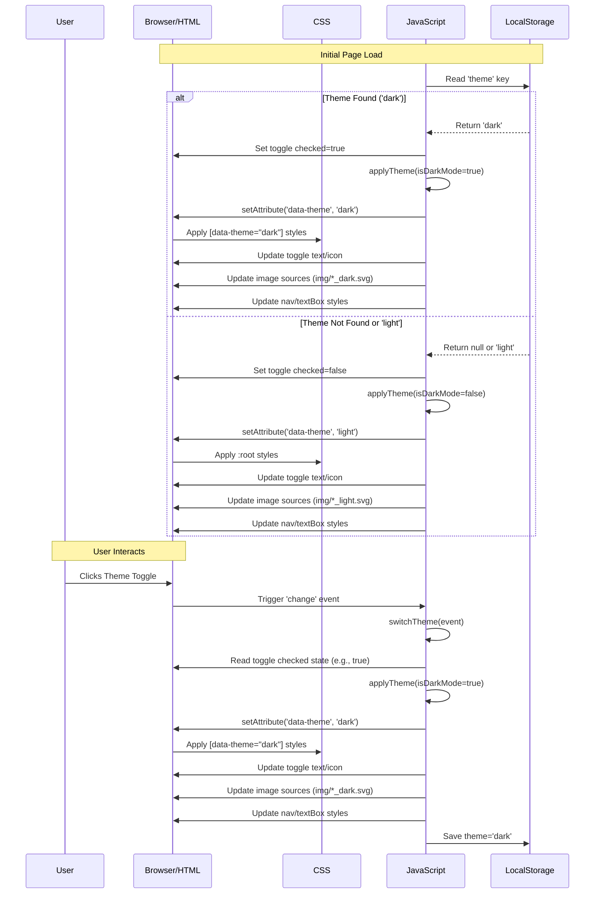

# System Architecture

This project is a purely **client-side/front-end application**. It runs entirely within the user's web browser and does not require any backend server or database interaction. Its primary goal is to demonstrate a UI pattern (light/dark mode switching) using standard web technologies.

## Project Folder Structure

```
light-and-dark-mode/
│
├── index.html          # Main HTML file containing the page structure and content.
├── style.css           # CSS file for styling, layout, and theme definitions.
├── script.js           # JavaScript file for theme switching logic and DOM manipulation.
└── img/                # Directory containing image assets.
    ├── undraw_proud_coder_light.svg
    ├── undraw_proud_coder_dark.svg
    ├── undraw_feeling_proud_light.svg
    ├── undraw_feeling_proud_dark.svg
    ├── undraw_conceptual_idea_light.svg
    ├── undraw_conceptual_idea_dark.svg
    └── favicon.png
```

## Major Components

1.  **HTML (`index.html`)**

    - Defines the semantic structure of the single-page application (nav, sections for Home, About, Projects, Contact).
    - Includes the necessary links to the CSS stylesheet (`style.css`), JavaScript file (`script.js`), and external libraries (Font Awesome).
    - Contains the structure for the theme switch toggle (a checkbox input with labels and icons).
    - Includes `` tags for illustrations that change with the theme.

2.  **CSS (`style.css`)**

    - Responsible for the visual presentation, layout, and styling of all elements.
    - Defines base styles and responsive behavior (implicitly through viewport height units).
    - Crucially, defines **CSS Custom Properties (Variables)** for colors and other themeable aspects:
      - Default (light) theme variables are defined within the `:root` pseudo-class.
      - Dark theme variables are defined within the `[data-theme="dark"]` attribute selector, overriding the defaults.
    - Styles elements using these variables (e.g., `color: var(--on-background);`).
    - Includes styles for the theme switch toggle appearance.

3.  **JavaScript (`script.js`)**

    - Handles the interactive logic for theme switching.
    - **Event Listener:** Attaches an event listener to the theme switch checkbox to detect changes.
    - **DOM Manipulation:**
      - Gets references to key DOM elements (nav, toggle icon, images, text box).
      - Applies/removes the `data-theme="dark"` attribute to the `<html>` element (`document.documentElement`).
      - Updates the text content of the toggle label ("Light Mode" / "Dark Mode").
      - Updates the class of the toggle icon (`fa-sun` / `fa-moon`).
      - Dynamically changes the `src` attribute of image elements to load theme-specific versions.
      - Applies specific background colors to `nav` and `textBox` (potentially for transparency effects not easily managed by variables alone).
    - **`localStorage` Interaction:**
      - Reads the stored theme preference on page load.
      - Saves the current theme preference whenever the user toggles the switch.

4.  **Image Assets (`img/`)**
    - Contains SVG illustrations. Separate versions are provided for light (`_light.svg`) and dark (`_dark.svg`) themes to ensure optimal appearance in both modes.

## Data Flow

The data flow revolves around the theme state:

**1. Initial Page Load:**
a. `script.js` executes.
b. Script checks `localStorage` for a stored `'theme'` value.
c. **If found:**
i. The theme value ('light' or 'dark') determines the initial state.
ii. The theme toggle checkbox is set to the corresponding state (checked/unchecked).
iii. `applyTheme()` function is called with the determined state.
iv. `applyTheme()` sets the `data-theme` attribute on `<html>`, updates toggle text/icon, image sources, and specific element styles (nav, text box).
v. CSS applies styles based on the `data-theme` attribute and CSS variables.
d. **If not found:**
i. The page defaults to the light theme (as defined by `:root` CSS variables and default checkbox state).
ii. No `data-theme` attribute is set initially, or it could be explicitly set to 'light'.

**2. User Toggles Theme Switch:**
a. The `change` event is triggered on the checkbox input.
b. The `switchTheme` event handler function in `script.js` executes.
c. It reads the new state of the checkbox (`e.target.checked`).
d. It calls the `applyTheme()` function with the new state (true for dark, false for light).
e. `applyTheme()` updates the `data-theme` attribute, toggle text/icon, image sources, and specific element styles.
f. CSS rules corresponding to the new `data-theme` value are applied, visually changing the theme.
g. The `switchTheme` function saves the new theme state ('light' or 'dark') to `localStorage` under the key `'theme'`.



## Design Decisions

- **CSS Custom Properties for Theming:** This is the modern, standard way to handle theming in CSS. It allows for easy definition and switching of themes by changing a single attribute on a high-level element (`<html>`). It's more maintainable than manually overriding styles for each element in JavaScript.
- **`localStorage` for Persistence:** `localStorage` provides a simple key-value store within the browser, suitable for persisting user preferences like theme choice across sessions without needing a backend.
- **Vanilla JavaScript:** For a project of this scope, using plain JavaScript without external frameworks or libraries (except Font Awesome for icons) keeps the codebase lightweight and avoids unnecessary dependencies.
- **Attribute Selector (`[data-theme]`)**: Using a `data-` attribute (`data-theme`) is a semantic and conventional way to apply state-based styling hooks in HTML, cleanly separating state information from CSS classes used for component styling.
- **Separate Theme Images:** Providing distinct images for light and dark modes ensures visual quality and appropriateness for each theme, improving the overall user experience. SVGs are used for scalability and potentially easier color manipulation if needed in the future.
- **Direct Style Manipulation (Minimal):** While most theming relies on CSS variables, direct style manipulation via JavaScript (`element.style.backgroundColor = ...`) is used for the `nav` and `textBox`. This might be due to needing semi-transparent backgrounds based on the theme colors, which can sometimes be simpler to calculate/apply directly in JS than composing complex `rgba()` values within CSS variables depending on the exact requirement.
